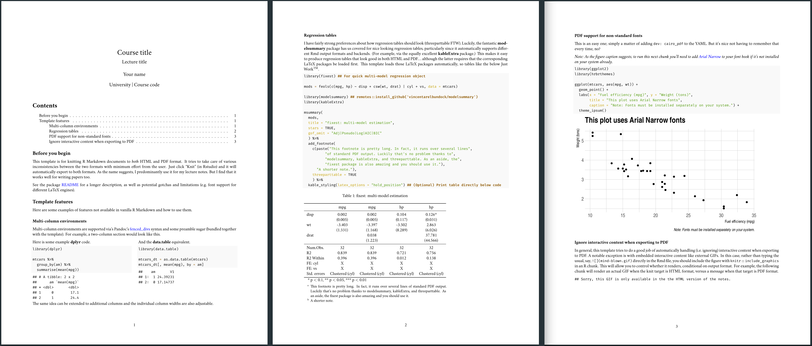
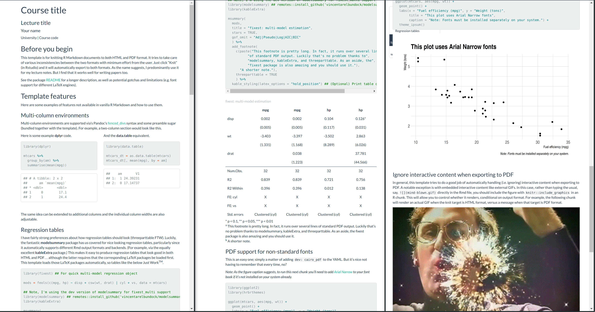

<!-- README.md is generated from README.Rmd. Please edit that file -->

# An R Markdown template for writing lecture notes and academic papers

<!-- badges: start -->
<!-- badges: end -->

[`Motivation`](#motivation) \| [`Installation`](#installation) \|
[`Limitations`](#limitations) \| [`Acknowledgements`](#acknowledgements)
\| [`License`](#license)

## Motivation

**lecturenotes** is a personalised .Rmd template that I use for writing
my lecture notes and academic papers. It is intended for documents that
are going to be exported (i.e. “knitted”) to both HTML and PDF formats.
In so doing, it tries to take care of various annoyances and
inconsistencies that arise between these two formats. For example:

-   Recognizing the author “affiliation” field in PDF documents.
-   Support for consistent multi-column environments in both HTML and
    PDF.
-   Support for non-standard fonts when knitting to PDF.
-   Sensible handling of interactive content depending on the output
    format.
-   Etc.

To get a sense of the resulting output, here are some screen grabs of
the knitted template:

1.  PDF 

2.  HTML 

## Installation

I don’t foresee submitting this bespoke package to CRAN. However, you
can easily install it from GitHub:

``` r
# install.packages("remotes")
remotes::install_github("grantmcdermott/lecturenotes")
```

Note that I use several external packages in the template to demonstrate
functionality. If you’d like to knit my template “as is”, making sure
that you don’t run into problems because you’re missing one of these
external packages, then you probably want to run the following command
instead:

``` r
# install.packages("renv")
renv::install("grantmcdermott/lecturenotes")
```

Once the package is installed, open up the **lecturenotes** template in
RStudio by navigating to:

    File > New File > R Markdown > From Template > Lecture Notes (lecturenotes)

Clicking on the “Knit” button thereafter will automatically produce both
output formats.

## Limitations

This R Markdown template was mostly designed for my own use. As such, it
comes with no guarantees; although, please do let me know if you run
into problems. Some potential limitations and requirements perhaps worth
highlighting:

-   The PDF output has only been tested on a TexLive distribution using
    XeLaTeX. I cannot guarantee that other LaTeX distributions or
    engines will work without some tinkering.
-   Similarly, I have adopted some opinionated takes on optimal LaTeX
    fonts. I use
    [Cochineal](https://www.ctan.org/tex-archive/fonts/cochineal) as the
    main font and [Fira](https://www.ctan.org/tex-archive/fonts/fira)
    for the sans and mono fonts. You may need to change or comment out
    [these
    lines](https://github.com/grantmcdermott/lecturenotes/blob/master/inst/rmarkdown/templates/template-name/skeleton/skeleton.Rmd#L31-L33)
    of the template, depending on your own system and/or preferences.
-   The template generally does a good job of automatically handling
    interactive content depending on the output format. For example, it
    tries to ignore interactive content when exporting to PDF. One
    notable exception is rendering of GIFs. I provide an example of how
    to handle this manually in the template itself.

## Acknowledgements

This template essentially pulls together a bunch of tips, tricks, and
ideas that I’ve accumulated over time to fit my own idiosyncratic
writing and formatting needs. Some of these I stumbled upon on myself,
most of them I found the old-fashioned way (i.e. searching on the
Internet). Here is a non-exhaustive list of helpful sources that I’ve
drawn upon.

-   <http://labrtorian.com/2019/08/26/rmarkdown-template-that-manages-academic-affiliations>
-   <https://bookdown.org/yihui/rmarkdown-cookbook/multi-column.html>
-   <https://pandoc.org/MANUAL.html#extension-fenced_divs>
-   <https://tex.stackexchange.com/q/135361>
-   <https://twitter.com/stevenvmiller/status/1351585981275758598>

## License

The material in this repository is made available under the [MIT
license](http://opensource.org/licenses/mit-license.php).
